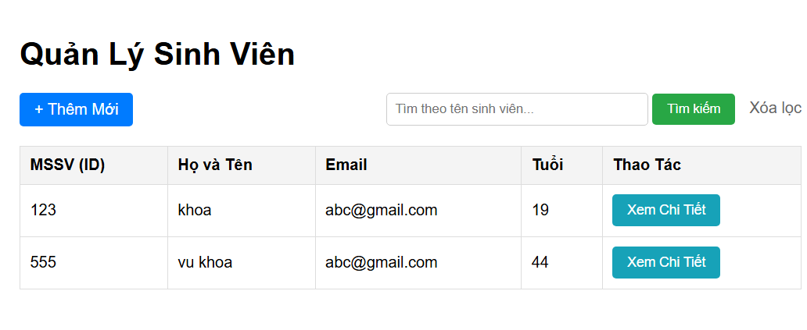
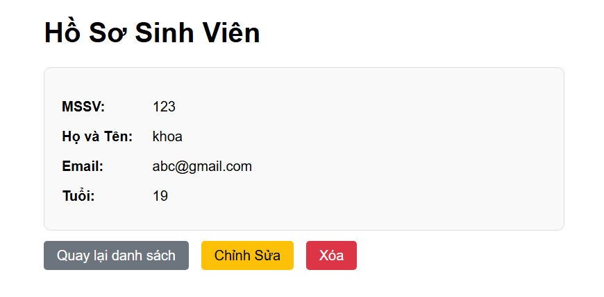
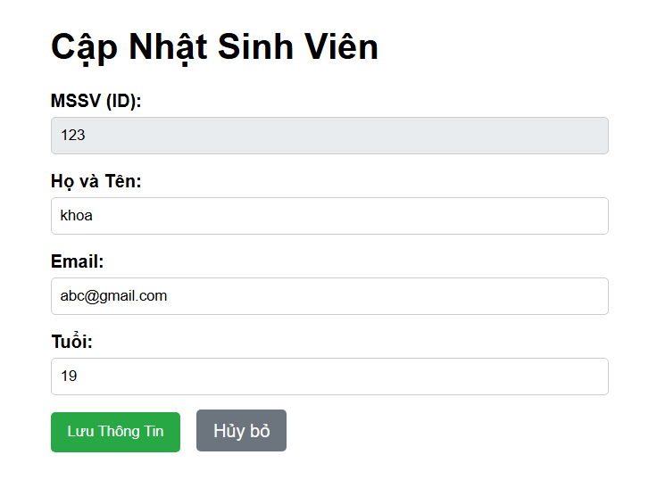
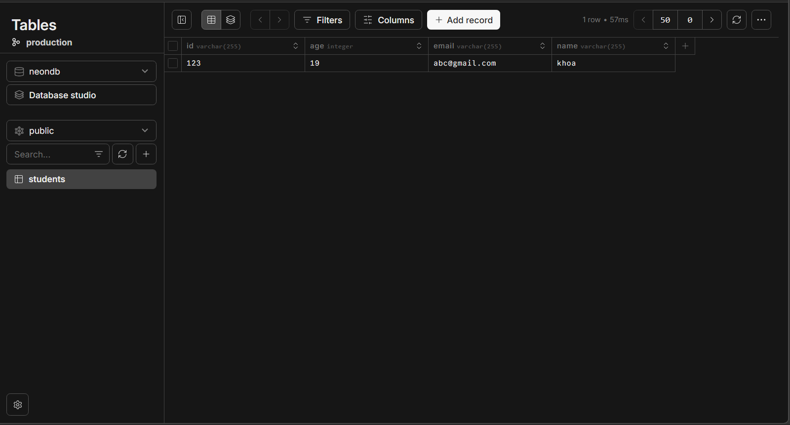

🎓 Dự án Quản lý Sinh viên 
Dự án này là hệ thống quản lý sinh viên được xây dựng bằng Spring Boot, triển khai container hóa với Docker và chạy thực tế trên nền tảng Render kết nối cơ sở dữ liệu Neon PostgreSQL.

👥 Danh sách nhóm
Thành viên: Vũ Minh Khoa

Mã số sinh viên: 2211667

Lớp: L02

🌐 Public URL
Web Service: https://cnpmnc-1.onrender.com

💻 Hướng dẫn cách chạy dự án
1. Yêu cầu hệ thống
Java 21+

Docker Desktop 

Tài khoản Neon.tech 

2. Cấu hình biến môi trường (Environment Variables)
Để dự án kết nối đúng Database, bạn cần thiết lập các biến sau:

SPRING_DATASOURCE_URL: jdbc:postgresql://ep-old-silence-a1arm48g-pooler.ap-southeast-1.aws.neon.tech/neondb?sslmode=require

SPRING_DATASOURCE_USERNAME: neondb_owner

SPRING_DATASOURCE_PASSWORD: [Mật khẩu trên Neon]

3. Chạy với Docker
Bash
# Di chuyển vào thư mục chứa Dockerfile
cd student-management

# Build Image
docker build -t student-app .

# Run Container
docker run -p 8080:8080 -e SPRING_DATASOURCE_URL=jdbc:postgresql://ep-old-silence-a1arm48g-pooler.ap-southeast-1.aws.neon.tech/neondb?sslmode=require -e SPRING_DATASOURCE_USERNAME=neondb_owner -e SPRING_DATASOURCE_PASSWORD=<password> student-app
4. Các câu hỏi lý thuyết
// Tại sao Database lại chặn thao tác chèn trùng Khóa chính (Primary Key)?
- Khóa chính được thiết kế để định danh duy nhất cho mỗi dòng dữ liệu trong một bảng.
- Việc ngăn chặn trùng lặp đảm bảo tính toàn vẹn dữ liệu, giúp hệ thống không bị nhầm lẫn giữa các đối tượng sinh viên khác nhau khi truy vấn hoặc cập nhật.

// Sự thiếu chặt chẽ khi để cột name là NULL ảnh hưởng gì khi code Java đọc dữ liệu?
- Lỗi NullPointerException: Trong Java, nếu Entity Student được ánh xạ từ Database mà trường name bị NULL, khi gọi các phương thức như student.getName().toUpperCase() mà không kiểm tra trước, chương trình sẽ bị văng lỗi NullPointerException.
- Dữ liệu không hợp lệ: Một sinh viên không có tên là một thực thể không có ý nghĩa về mặt nghiệp vụ, gây khó khăn cho việc hiển thị trên giao diện người dùng và xử lý logic ở tầng Service.

// Tại sao cần xây dựng REST API trước khi phát triển giao diện?
- Giúp đảm bảo các logic nghiệp vụ tại tầng Service và Repository hoạt động chính xác trước khi lo lắng về phần hiển thị.
- Khả năng mở rộng: Một hệ thống API chuẩn trả về JSON có thể phục vụ cùng lúc cho nhiều nền tảng khác nhau như Web, Mobile App (React Native, Flutter) hoặc các đối tác thứ ba

//Sự khác biệt giữa REST API và Server-Side Rendering (SSR)?
- REST API (Lab 2): Controller trả về dữ liệu thô dưới định dạng JSON. Trình duyệt hoặc ứng dụng Frontend sẽ chịu trách nhiệm xử lý và hiển thị giao diện.
- SSR Web (Lab 3): Controller sử dụng công cụ như Thymeleaf để điền dữ liệu vào file HTML ngay tại Server và trả về một trang web hoàn chỉnh đã được Render cho trình duyệt

5. Screenshot dự án
### 1. Trang Danh sách (List View)

### 2. Trang Chi tiết (Detail View)

### 3. Trang Thêm mới (Add Student)

### 4. Trang Chỉnh sửa (Edit Student)

### 5. Quản lý Database trên Neon

